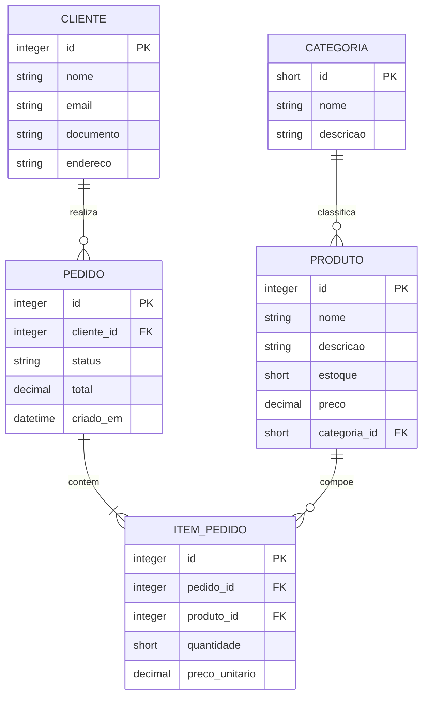

# Modelo de dados

```mermaid
erDiagram
    CATEGORIA ||--o{ PRODUTO : classifica
    CLIENTE ||--o{ PEDIDO : realiza
    PEDIDO ||--|{ ITEM_PEDIDO : contem
    PRODUTO ||--o{ ITEM_PEDIDO : compoe

    CATEGORIA {
        short id PK
        string nome
        string descricao
    }
    PRODUTO {
        integer id PK
        string nome
        string descricao
        short estoque
        decimal preco
        short categoria_id FK
    }
    CLIENTE {
        integer id PK
        string nome
        string email
        string documento
        string endereco
    }
    PEDIDO {
        integer id PK
        integer cliente_id FK
        string status
        decimal total
        datetime criado_em
    }
    ITEM_PEDIDO {
        integer id PK
        integer pedido_id FK
        integer produto_id FK
        short quantidade
        decimal preco_unitario
    }
```
