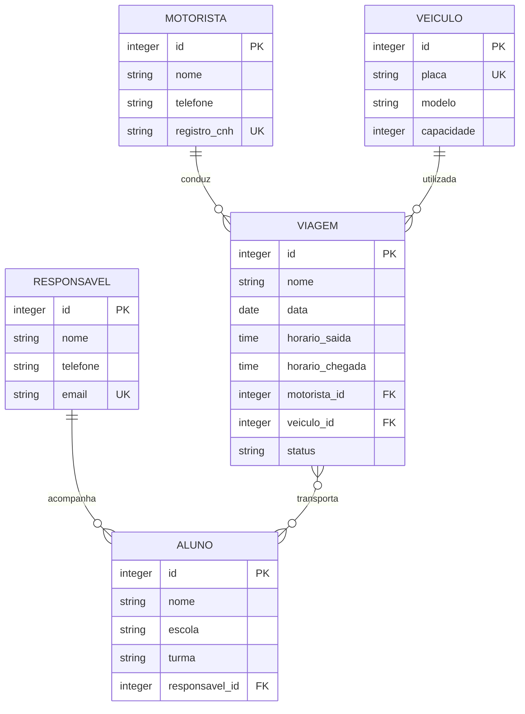

# Modelo de dados ToAqui

```mermaid
erDiagram
    RESPONSAVEL ||--o{ ALUNO : acompanha
    MOTORISTA ||--o{ VIAGEM : conduz
    VEICULO ||--o{ VIAGEM : utilizada
    VIAGEM }o--o{ ALUNO : transporta

    RESPONSAVEL {
        integer id PK
        string nome
        string telefone
        string email UK
    }
    ALUNO {
        integer id PK
        string nome
        string escola
        string turma
        integer responsavel_id FK
    }
    MOTORISTA {
        integer id PK
        string nome
        string telefone
        string registro_cnh UK
    }
    VEICULO {
        integer id PK
        string placa UK
        string modelo
        integer capacidade
    }
    VIAGEM {
        integer id PK
        string nome
        date data
        time horario_saida
        time horario_chegada
        integer motorista_id FK
        integer veiculo_id FK
        string status
    }
```
